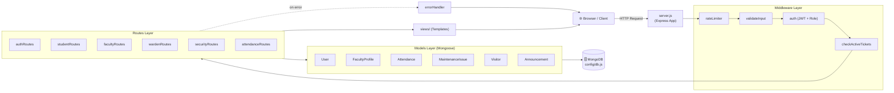
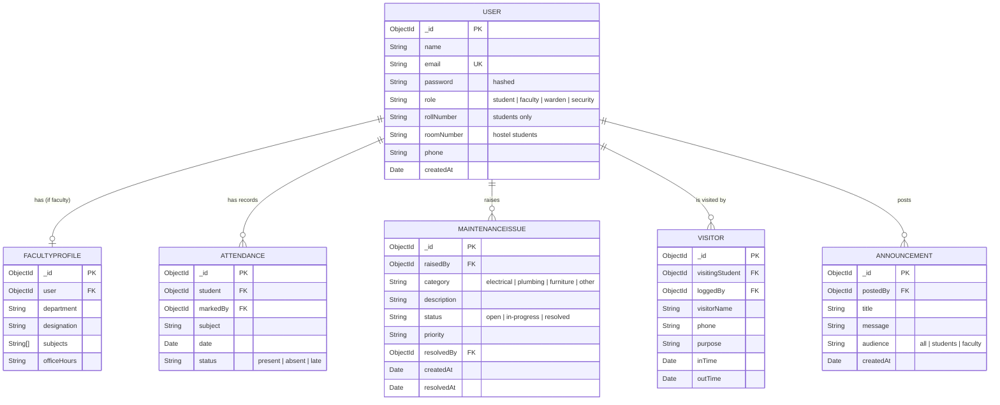
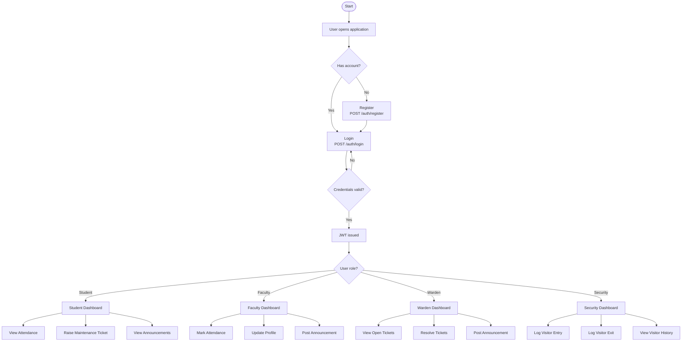
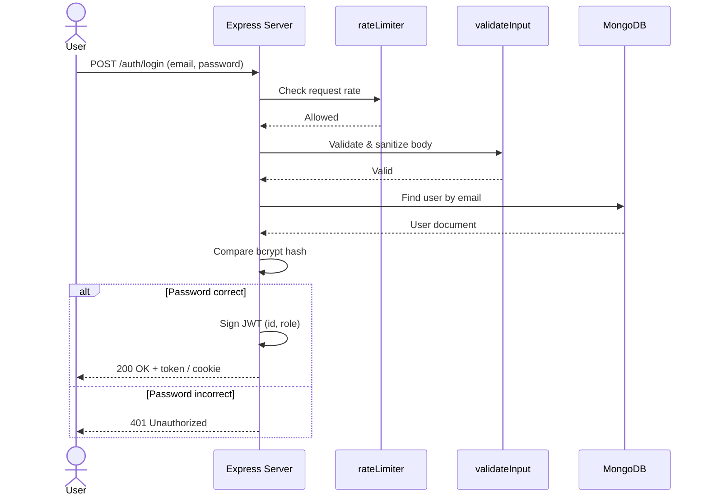
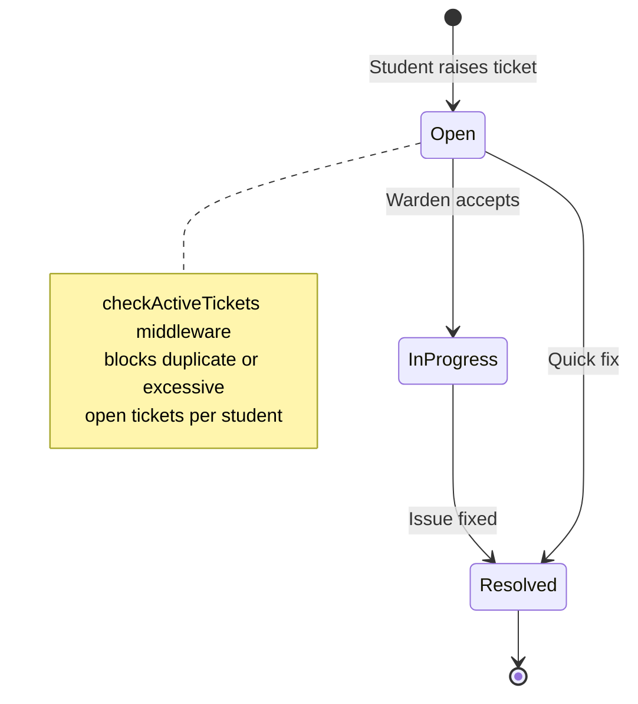
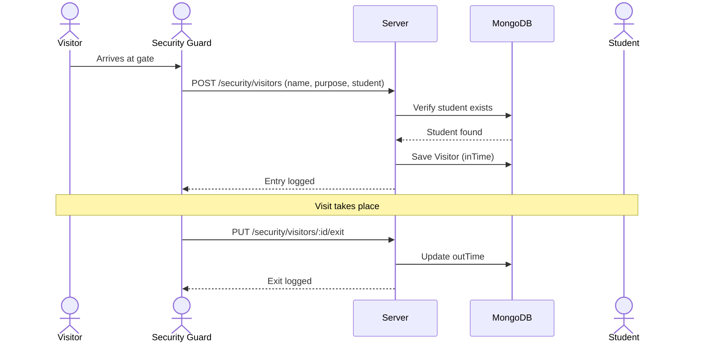
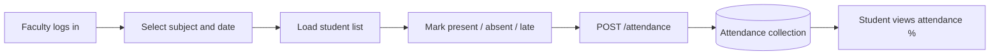
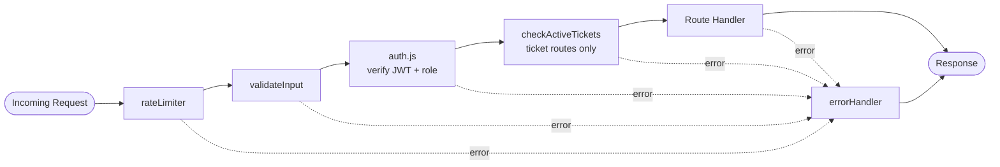

# 🏫 Campus & Hostel Management System

A role-based **Node.js / Express / MongoDB** web application for managing campus and hostel operations: student attendance, maintenance tickets, visitor tracking, faculty profiles, and announcements, with separate dashboards for **Students, Faculty, Wardens and Security**.

> **Note:** Fields, endpoints and environment variables below are inferred from the project structure. Adjust names to match your actual code where they differ.

---

## 📑 Table of Contents

1. [Features](#-features)
2. [Tech Stack](#-tech-stack)
3. [System Architecture](#-system-architecture)
4. [Project Structure](#-project-structure)
5. [Data Models (Database Structure)](#-data-models-database-structure)
6. [Project Flow](#-project-flow)
7. [Middleware Pipeline](#-middleware-pipeline)
8. [API Routes](#-api-routes)
9. [Installation & Setup](#-installation--setup)
10. [Environment Variables](#-environment-variables)
11. [Seeding the Database](#-seeding-the-database)
12. [Security Measures](#-security-measures)
13. [Future Improvements](#-future-improvements)
14. [License](#-license)

---

## ✨ Features

| Role | Capabilities |
|------|--------------|
| 🎓 **Student** | Login, view attendance, raise maintenance tickets, view announcements, register visitors |
| 👨‍🏫 **Faculty** | Manage profile, mark/view attendance, post announcements |
| 🛏️ **Warden** | Review & resolve maintenance issues, monitor hostel students, post announcements |
| 💂 **Security** | Log visitor entry/exit, verify visitors against students |
| 🔐 **Common** | JWT authentication, role-based access, rate limiting, input validation, centralized error handling |

---

## 🛠 Tech Stack

- **Runtime:** Node.js
- **Framework:** Express.js
- **Database:** MongoDB with Mongoose ODM
- **Auth:** JSON Web Tokens (JWT) + bcrypt password hashing
- **Views:** Server-side templates (`views/`, e.g. EJS)
- **Security:** express-rate-limit, input validation middleware
- **Tools:** dotenv, nodemon, Git

---

## 🏗 System Architecture



---

## 📂 Project Structure

```
project-root/
│
├── config/
│   └── db.js                  # MongoDB connection setup
│
├── middleware/
│   ├── auth.js                # JWT verification + role-based authorization
│   ├── checkActiveTickets.js  # Prevents duplicate / excess open tickets
│   ├── errorHandler.js        # Centralized error handling
│   ├── rateLimiter.js         # Throttles repeated requests (brute-force protection)
│   └── validateInput.js       # Sanitizes and validates request bodies
│
├── models/
│   ├── Announcement.js        # Notices posted by faculty / warden
│   ├── Attendance.js          # Daily attendance records
│   ├── FacultyProfile.js      # Faculty details (extends User)
│   ├── MaintenanceIssue.js    # Hostel / campus maintenance tickets
│   ├── User.js                # Base user (student, faculty, warden, security)
│   └── Visitor.js             # Visitor entry / exit logs
│
├── routes/
│   ├── attendanceRoutes.js    # Mark & fetch attendance
│   ├── authRoutes.js          # Register / login / logout
│   ├── facultyRoutes.js       # Faculty dashboard & actions
│   ├── securityRoutes.js      # Visitor management
│   ├── studentRoutes.js       # Student dashboard & tickets
│   └── wardenRoutes.js        # Warden dashboard & ticket resolution
│
├── utils/                     # Helper functions (tokens, formatters, etc.)
├── views/                     # Frontend templates
│
├── .gitignore
├── package.json
├── package-lock.json
├── seed.js                    # Populates DB with sample data
└── server.js                  # Application entry point
```

---

## 🗃 Data Models (Database Structure)

### Entity Relationship Diagram



### Model Summary

| Model | Purpose | Key Relations |
|-------|---------|---------------|
| `User` | Central identity & role store | Referenced by all other models |
| `FacultyProfile` | Extra faculty information | `user → User` |
| `Attendance` | Per-student, per-day attendance | `student → User`, `markedBy → User` |
| `MaintenanceIssue` | Ticketing system for repairs | `raisedBy → User`, `resolvedBy → User` |
| `Visitor` | Entry/exit logbook for hostel visitors | `visitingStudent → User`, `loggedBy → User` |
| `Announcement` | Notices for audiences | `postedBy → User` |

---

## 🔄 Project Flow

### 1. Overall Application Flow



### 2. Authentication Sequence



### 3. Maintenance Ticket Lifecycle



### 4. Visitor Management Flow



### 5. Attendance Flow



---

## 🧱 Middleware Pipeline



| Middleware | Responsibility |
|-----------|----------------|
| `rateLimiter.js` | Limits requests per IP to prevent abuse and brute-force login |
| `validateInput.js` | Validates and sanitizes request body, params and query |
| `auth.js` | Verifies JWT, attaches `req.user`, restricts routes by role |
| `checkActiveTickets.js` | Ensures a student cannot exceed the allowed number of open tickets |
| `errorHandler.js` | Catches all errors and returns consistent JSON / error pages |

---

## 🌐 API Routes

> Base URL: `http://localhost:5000`

### 🔑 Auth — `routes/authRoutes.js`
| Method | Endpoint | Access | Description |
|--------|----------|--------|-------------|
| POST | `/auth/register` | Public | Register a new user |
| POST | `/auth/login` | Public | Login and receive JWT |
| POST | `/auth/logout` | Authenticated | Logout |

### 🎓 Student — `routes/studentRoutes.js`
| Method | Endpoint | Access | Description |
|--------|----------|--------|-------------|
| GET | `/student/dashboard` | Student | Dashboard overview |
| GET | `/student/attendance` | Student | Own attendance |
| POST | `/student/issues` | Student | Raise maintenance ticket |
| GET | `/student/issues` | Student | List own tickets |
| GET | `/student/announcements` | Student | View announcements |

### 👨‍🏫 Faculty — `routes/facultyRoutes.js`
| Method | Endpoint | Access | Description |
|--------|----------|--------|-------------|
| GET | `/faculty/dashboard` | Faculty | Dashboard overview |
| GET / PUT | `/faculty/profile` | Faculty | View / update profile |
| POST | `/faculty/announcements` | Faculty | Post announcement |

### 🗓 Attendance — `routes/attendanceRoutes.js`
| Method | Endpoint | Access | Description |
|--------|----------|--------|-------------|
| POST | `/attendance` | Faculty | Mark attendance |
| GET | `/attendance/:studentId` | Faculty / Student | Fetch attendance |

### 🛏 Warden — `routes/wardenRoutes.js`
| Method | Endpoint | Access | Description |
|--------|----------|--------|-------------|
| GET | `/warden/dashboard` | Warden | Dashboard overview |
| GET | `/warden/issues` | Warden | All maintenance tickets |
| PUT | `/warden/issues/:id` | Warden | Update / resolve ticket |
| POST | `/warden/announcements` | Warden | Post announcement |

### 💂 Security — `routes/securityRoutes.js`
| Method | Endpoint | Access | Description |
|--------|----------|--------|-------------|
| POST | `/security/visitors` | Security | Log visitor entry |
| PUT | `/security/visitors/:id/exit` | Security | Log visitor exit |
| GET | `/security/visitors` | Security | Visitor history |

---

## ⚙️ Installation & Setup

### Prerequisites
- [Node.js](https://nodejs.org/) v18+
- [MongoDB](https://www.mongodb.com/) (local or Atlas)
- npm

### Steps

#1. Clone the repository and open its folder.

#2. Install dependencies:

   ```bash
   npm install
   ```

#3. Create a `.env` file in the project root and configure your environment variables:

   ```env
   PORT=3000
   MONGO_URI=mongodb://127.0.0.1:27017/hostelDB
   SESSION_SECRET=replace_with_a_secure_random_secret
   JWT_SECRET=replace_with_a_secure_random_secret
   ```

#4. Ensure MongoDB is running and the database connection settings are correct.

#5. Start the application:

   ```bash
   npm start
   ```

#6. Open `http://localhost:3000` in your browser.

#**Note:** The default port is 3000. If a different `PORT` is configured, use that port instead. Keep `.env` private and never commit real secrets to GitHub.

---

## 🔧 Environment Variables

Create a `.env` file in the project root:

```env
PORT=5000
MONGO_URI=mongodb://localhost:27017/campus_management
JWT_SECRET=your_super_secret_key
JWT_EXPIRES_IN=1d
NODE_ENV=development
```

> ⚠️ Never commit `.env` — it is already listed in `.gitignore`.

---

## 🌱 Seeding the Database

`seed.js` inserts sample users for each role plus demo data:

```bash
node seed.js
```

| Role | Email (example) | Password (example) |
|------|-----------------|--------------------|
| Student | student@example.com | password123 |
| Faculty | faculty@example.com | password123 |
| Warden | warden@example.com | password123 |
| Security | security@example.com | password123 |

*(Update this table to match the values in your `seed.js`.)*

---

## 🔒 Security Measures

- 🔐 Passwords hashed with **bcrypt**
- 🪪 **JWT**-based stateless authentication
- 🛂 **Role-based access control** in `auth.js`
- 🚦 **Rate limiting** against brute force and DoS
- 🧼 **Input validation & sanitization** against injection attacks
- 🧯 Centralized **error handling** (no stack traces leaked in production)
- 🙈 Secrets kept in environment variables

---

## 🚀 Future Improvements

- [ ] Email / SMS notifications for ticket updates and visitor arrival
- [ ] Leave / outpass management for hostel students
- [ ] Attendance analytics and charts
- [ ] File / image upload for maintenance tickets
- [ ] Unit and integration tests (Jest + Supertest)
- [ ] Docker & CI/CD pipeline
- [ ] REST API documentation with the Swagger

---

## 🤝 Contributing

1. Fork the repository.
2. Create a feature branch: `git checkout -b feature/your-feature`
3. Commit your changes: `git commit -m "Add your feature"`
4. Push the branch: `git push origin feature/your-feature`
5. Open a Pull Request,

---

## 📄 License

This project is licensed under the **MIT License**.

---

<p align="center">Made with ❤️ using Node.js, Express & MongoDB</p>
